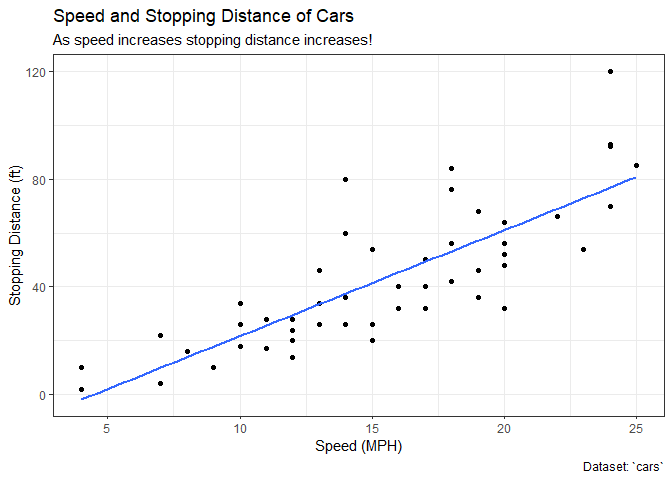
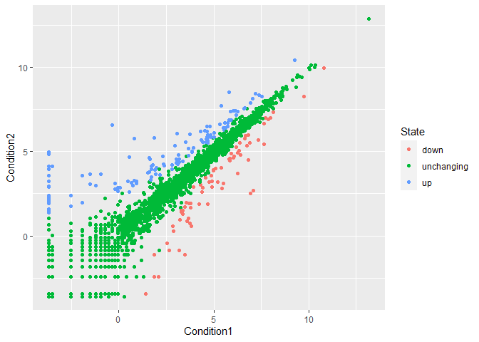
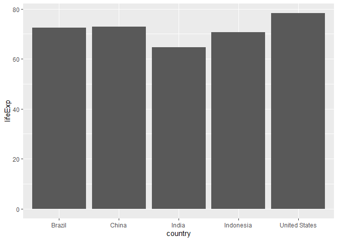
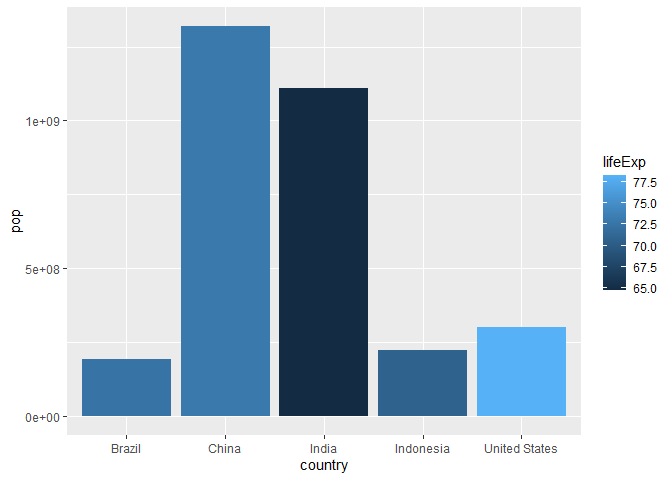

# BIMM143class05 Data Visualization with ggplot2
A15827934

## Using GGPLOT

\##The ggplot2 package needs to be installed as it does not come with R
“out of the box”.

\##We use the ‘install.packages()’ function to do this.

``` r
head(cars)
```

      speed dist
    1     4    2
    2     4   10
    3     7    4
    4     7   22
    5     8   16
    6     9   10

\##To use ggplot I need to load it up before I can call any of the
functions in the package. I do this with the `library()` function.

``` r
library(ggplot2)
ggplot()
```


\##All ggplot figures have at least three things: \##-data(the stuff we
want to plot) \##-aesthetics mapping(aes values) \##-geometry

``` r
ggplot(cars) + 
  aes(x=speed, y=dist) + 
  geom_point()
```


\##ggplot is not the only graphing system in R there are lots of others.
THere is even “base R” graphics.

``` r
plot(cars)
```


``` r
library(ggplot2)
ggplot(cars) +  
aes(x=speed, y=dist) + 
geom_point() + 
labs(title="Speed and Stopping Distance of Cars", x="Speed (MPH)", y="Stopping Distance (ft)", subtitle="As speed increases stopping distance increases!", caption="Dataset: `cars`") + 
geom_smooth(method="lm", se=FALSE) + 
theme_bw()
```

    `geom_smooth()` using formula = 'y ~ x'



``` r
url<-"https://bioboot.github.io/bimm143_S20/class-material/up_down_expression.txt"
genes<-read.delim(url)
head(genes)
```

            Gene Condition1 Condition2      State
    1      A4GNT -3.6808610 -3.4401355 unchanging
    2       AAAS  4.5479580  4.3864126 unchanging
    3      AASDH  3.7190695  3.4787276 unchanging
    4       AATF  5.0784720  5.0151916 unchanging
    5       AATK  0.4711421  0.5598642 unchanging
    6 AB015752.4 -3.6808610 -3.5921390 unchanging

``` r
nrow(genes)
```

    [1] 5196

``` r
colnames(genes)
```

    [1] "Gene"       "Condition1" "Condition2" "State"     

``` r
ncol(genes)
```

    [1] 4

``` r
table(genes$State)
```


          down unchanging         up 
            72       4997        127 

``` r
round(table(genes$State)/nrow(genes)*100, 2)
```


          down unchanging         up 
          1.39      96.17       2.44 

``` r
p <- ggplot(genes) + 
    aes(x=Condition1, y=Condition2, col=State) + 
    geom_point()
p
```



``` r
p +  scale_colour_manual( values=c("blue","gray","red") ) + labs(title="Gene Expression Changes Upon Drug Treatment", x="Control (no drug)", y="Drug Treatment" )
```


``` r
library(gapminder)
# install.packages("dplyr") to install dplyr
library(dplyr)
```


    Attaching package: 'dplyr'

    The following objects are masked from 'package:stats':

        filter, lag

    The following objects are masked from 'package:base':

        intersect, setdiff, setequal, union

``` r
gapminder_2007 <- gapminder %>% filter(year==2007)
ggplot(gapminder_2007)+ 
aes(x=gdpPercap, y=lifeExp, color=continent, size=pop)+geom_point(alpha=0.5)
```


``` r
ggplot(gapminder_2007) +  
  aes(x = gdpPercap, y = lifeExp, color = pop) + 
  geom_point(alpha=0.8)
```


``` r
ggplot(gapminder_2007) + 
  aes(x=gdpPercap, y=lifeExp, size=pop) + geom_point(alpha=0.5) + 
scale_size_area(max_size=10)
```


``` r
library(dplyr)

gapminder_1957 <- gapminder %>% filter(year==1957 | year==2007)

ggplot(gapminder_1957)+ 
  aes(x= gdpPercap, y=lifeExp,color=continent, size=pop) +
  geom_point(alpha=0.7) + 
  scale_size_area(max_size=10) + 
  facet_wrap(~year)
```


``` r
gapminder_top5<- gapminder %>%
  filter(year==2007) %>%
  arrange(desc(pop)) %>%
  top_n(5,pop)
gapminder_top5
```

    # A tibble: 5 × 6
      country       continent  year lifeExp        pop gdpPercap
      <fct>         <fct>     <int>   <dbl>      <int>     <dbl>
    1 China         Asia       2007    73.0 1318683096     4959.
    2 India         Asia       2007    64.7 1110396331     2452.
    3 United States Americas   2007    78.2  301139947    42952.
    4 Indonesia     Asia       2007    70.6  223547000     3541.
    5 Brazil        Americas   2007    72.4  190010647     9066.

``` r
ggplot(gapminder_top5) + 
aes(x=country, y=pop) +  
geom_col()
```


``` r
ggplot(gapminder_top5) +
  aes(x=country, y=lifeExp) + 
  geom_col()
```



``` r
ggplot(gapminder_top5) + 
  aes(x=country, y=pop, fill=continent) + 
  geom_col()
```


``` r
ggplot(gapminder_top5) + 
  aes(x=country, y=pop, fill=lifeExp) + 
  geom_col()
```



``` r
ggplot(gapminder_top5) + 
  aes(x=reorder(country, -pop), y=pop, fill=country) + 
  geom_col(col="gray30") + 
  guides(fill="none")
```


``` r
head(USArrests)
```

               Murder Assault UrbanPop Rape
    Alabama      13.2     236       58 21.2
    Alaska       10.0     263       48 44.5
    Arizona       8.1     294       80 31.0
    Arkansas      8.8     190       50 19.5
    California    9.0     276       91 40.6
    Colorado      7.9     204       78 38.7

``` r
USArrests$State <- rownames(USArrests)
ggplot(USArrests) +
  aes(x=reorder(State,Murder), y=Murder) +
  geom_col() +
  coord_flip()
```


``` r
ggplot(USArrests) +
  aes(x=reorder(State,Murder), y=Murder) +
  geom_point() +
  geom_segment(aes(x=State, 
                   xend=State, 
                   y=0, 
                   yend=Murder), color="blue") +
  coord_flip()
```


    ##library(gapminder)
    ##library(gganimate)

    ## Setup nice regular ggplot of the gapminder data
    ggplot(gapminder, aes(gdpPercap, lifeExp, size = pop, colour = country)) +
      geom_point(alpha = 0.7, show.legend = FALSE) +
      scale_colour_manual(values = country_colors) +
      scale_size(range = c(2, 12)) +
      scale_x_log10() +
      # Facet by continent
      facet_wrap(~continent) +
      # Here comes the gganimate specific bits
      labs(title = 'Year: {frame_time}', x = 'GDP per capita', y = 'life expectancy') +
      transition_time(year) +
      shadow_wake(wake_length = 0.1, alpha = FALSE)


    ::: {.cell}

    ```{.r .cell-code}
    library(patchwork)
    ## use car data

    p1 <- ggplot(mtcars) + 
      geom_point(aes(mpg, disp))
    p2 <- ggplot(mtcars) + 
      geom_boxplot(aes(gear, disp, group = gear))
    p3 <- ggplot(mtcars) + 
      geom_smooth(aes(disp, qsec))
    p4 <- ggplot(mtcars) + 
      geom_bar(aes(carb))

    ##use patchwork to merge them all

    (p1|p2|p3)/p4

<div class="cell-output cell-output-stderr">

    `geom_smooth()` using method = 'loess' and formula = 'y ~ x'

</div>

<div class="cell-output-display">


</div>

:::
