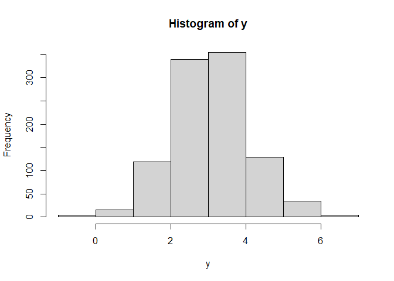
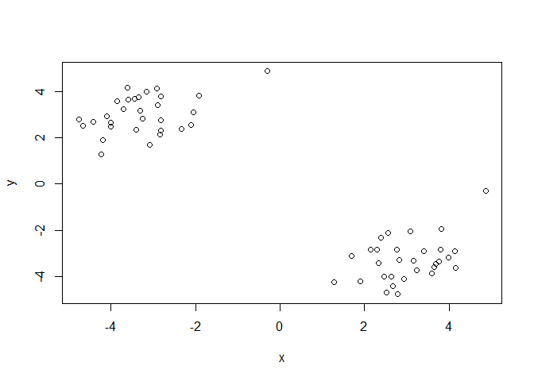
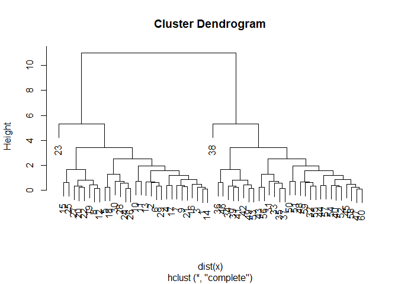
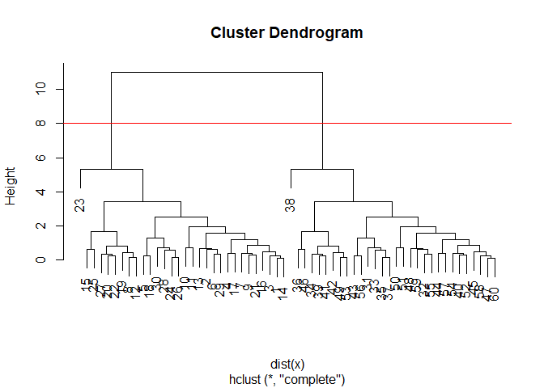
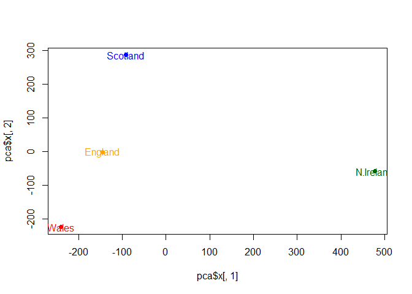
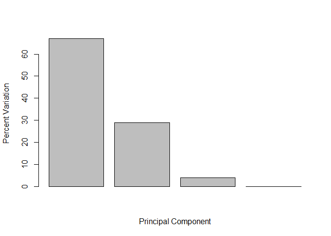

# BIMM143class07
A15827934

\#Clustering

We will start today’s lab with clustering methods, in particular
K-means. The main function for this in R is `kmeans()`

Let’s try it on some made up data where we know what the answer should
be.

``` r
x<-rnorm(1000)
hist(x)
```


``` r
y<-rnorm(1000, mean=3)
hist(y)
```



60 points

``` r
tmp<-c(rnorm(30, mean=3), rnorm(30, -3))
x<-cbind(x=tmp, y=rev(tmp))
head(x)
```

                x         y
    [1,] 3.679386 -3.445290
    [2,] 2.765391 -2.829703
    [3,] 3.651565 -3.596754
    [4,] 3.238247 -3.709281
    [5,] 2.550583 -2.113982
    [6,] 3.149170 -3.304869

We can pass this to the base R `plot()` function for a quick

``` r
plot(x)
```



``` r
k<-kmeans(x, centers=2, nstart=20)
```

``` r
k
```

    K-means clustering with 2 clusters of sizes 30, 30

    Cluster means:
              x         y
    1  3.014214 -3.269078
    2 -3.269078  3.014214

    Clustering vector:
     [1] 1 1 1 1 1 1 1 1 1 1 1 1 1 1 1 1 1 1 1 1 1 1 1 1 1 1 1 1 1 1 2 2 2 2 2 2 2 2
    [39] 2 2 2 2 2 2 2 2 2 2 2 2 2 2 2 2 2 2 2 2 2 2

    Within cluster sum of squares by cluster:
    [1] 44.78047 44.78047
     (between_SS / total_SS =  93.0 %)

    Available components:

    [1] "cluster"      "centers"      "totss"        "withinss"     "tot.withinss"
    [6] "betweenss"    "size"         "iter"         "ifault"      

> Q1. How many points are in each cluster?

``` r
k$size
```

    [1] 30 30

> Q2. Cluster Membership?

``` r
k$cluster
```

     [1] 1 1 1 1 1 1 1 1 1 1 1 1 1 1 1 1 1 1 1 1 1 1 1 1 1 1 1 1 1 1 2 2 2 2 2 2 2 2
    [39] 2 2 2 2 2 2 2 2 2 2 2 2 2 2 2 2 2 2 2 2 2 2

> Q3. Cluster centers?

``` r
k$centers
```

              x         y
    1  3.014214 -3.269078
    2 -3.269078  3.014214

> Q4. Plot my clustering results

``` r
plot(x, col=k$cluster, pch=16)
```


> Q5. Clustering the data again with kmeans() into 4 groups and plot the
> results

``` r
k4<-kmeans(x, centers=4, nstart=20)
k
```

    K-means clustering with 2 clusters of sizes 30, 30

    Cluster means:
              x         y
    1  3.014214 -3.269078
    2 -3.269078  3.014214

    Clustering vector:
     [1] 1 1 1 1 1 1 1 1 1 1 1 1 1 1 1 1 1 1 1 1 1 1 1 1 1 1 1 1 1 1 2 2 2 2 2 2 2 2
    [39] 2 2 2 2 2 2 2 2 2 2 2 2 2 2 2 2 2 2 2 2 2 2

    Within cluster sum of squares by cluster:
    [1] 44.78047 44.78047
     (between_SS / total_SS =  93.0 %)

    Available components:

    [1] "cluster"      "centers"      "totss"        "withinss"     "tot.withinss"
    [6] "betweenss"    "size"         "iter"         "ifault"      

``` r
plot(x, col=k4$cluster, pch=16)
```


K-means is very popular mostly because it is fast and relatively
straightforward to run and understand. It has a big limitation in that
you need to tell it how many groups(k, or centers) you want.

\#Hierarchhical clustering The main function in base R is called
`hclust()`. You have to pass it in a “distance matrix” not just your
input data.

You can generate a distance matrix with the `dist()` function.

``` r
hc<-hclust(dist(x))
hc
```


    Call:
    hclust(d = dist(x))

    Cluster method   : complete 
    Distance         : euclidean 
    Number of objects: 60 

``` r
plot(hc)
```



To find clusters (cluster membership vector) from a `hclust()` results
we can “cut” the tree at a certain height that we like

``` r
plot(hc)
abline(h=8, col="red")
```



``` r
grps<-cutree(hc, h=8)

table(grps)
```

    grps
     1  2 
    30 30 

> Q6. Plot our hclust results.

``` r
plot(x, col=grps)
```


\#Principal Component Analysis

\##PCA of UK food data

``` r
url<- "https://tinyurl.com/UK-foods"
x<-read.csv(url)
x
```

                         X England Wales Scotland N.Ireland
    1               Cheese     105   103      103        66
    2        Carcass_meat      245   227      242       267
    3          Other_meat      685   803      750       586
    4                 Fish     147   160      122        93
    5       Fats_and_oils      193   235      184       209
    6               Sugars     156   175      147       139
    7      Fresh_potatoes      720   874      566      1033
    8           Fresh_Veg      253   265      171       143
    9           Other_Veg      488   570      418       355
    10 Processed_potatoes      198   203      220       187
    11      Processed_Veg      360   365      337       334
    12        Fresh_fruit     1102  1137      957       674
    13            Cereals     1472  1582     1462      1494
    14           Beverages      57    73       53        47
    15        Soft_drinks     1374  1256     1572      1506
    16   Alcoholic_drinks      375   475      458       135
    17      Confectionery       54    64       62        41

``` r
##Q1. How many rows and columns are in your new data frame named x? What R functions could you use to answer this questions?
dim(x)
```

    [1] 17  5

``` r
head(x)
```

                   X England Wales Scotland N.Ireland
    1         Cheese     105   103      103        66
    2  Carcass_meat      245   227      242       267
    3    Other_meat      685   803      750       586
    4           Fish     147   160      122        93
    5 Fats_and_oils      193   235      184       209
    6         Sugars     156   175      147       139

# Minus can also be used on table data, rows, columns

``` r
##rownames(x) <- x[,1]
##x <- x[,-1]
##head(x)
##it consistently remove column everytime.
##dangerous!
```

``` r
dim(x)
```

    [1] 17  5

``` r
x <- read.csv(url, row.names=1)
head(x)
```

                   England Wales Scotland N.Ireland
    Cheese             105   103      103        66
    Carcass_meat       245   227      242       267
    Other_meat         685   803      750       586
    Fish               147   160      122        93
    Fats_and_oils      193   235      184       209
    Sugars             156   175      147       139

``` r
##Q2. Which approach to solving the ‘row-names problem’ mentioned above do you prefer and why? Is one approach more robust than another under certain circumstances?

##The latter in the former if you keep putting -1 in the column and running the code it will delete a column each and everytime. Dangerous!!


barplot(as.matrix(x), beside=T, col=rainbow(nrow(x)))
```


``` r
##Q3: Changing what optional argument in the above barplot() function results in the following plot?

##beside to FALSE

barplot(as.matrix(x), beside=F, col=rainbow(nrow(x)))
```


``` r
pairs(x, col=rainbow(10), pch=16)
```


``` r
##Q5: Generating all pairwise plots may help somewhat. Can you make sense of the following code and resulting figure? What does it mean if a given point lies on the diagonal for a given plot?

##basically if you want to compare say between North Ireland and England you either look at bottom left or top right to interpret data. THat is how you read it. As for diagonal lines those in diagonal lines more or less similar. If it is slightly off the diagonal lines likely an outlier. 

##Q6. What is the main differences between N. Ireland and the other countries of the UK in terms of this data-set?

##it seems North Ireland has move outliers numbers outside the diagonal straight line compared to other regiosn
```

\##Principal Component Analysis (PCA)

PCA can help us make sense of these types of datassets. Let us see how
it works

The main function in “base” R is called `prcomp()`.

In this case, we want to first take the transpose of our input `x`

``` r
head(t(x))
```

              Cheese Carcass_meat  Other_meat  Fish Fats_and_oils  Sugars
    England      105           245         685  147            193    156
    Wales        103           227         803  160            235    175
    Scotland     103           242         750  122            184    147
    N.Ireland     66           267         586   93            209    139
              Fresh_potatoes  Fresh_Veg  Other_Veg  Processed_potatoes 
    England               720        253        488                 198
    Wales                 874        265        570                 203
    Scotland              566        171        418                 220
    N.Ireland            1033        143        355                 187
              Processed_Veg  Fresh_fruit  Cereals  Beverages Soft_drinks 
    England              360         1102     1472        57         1374
    Wales                365         1137     1582        73         1256
    Scotland             337          957     1462        53         1572
    N.Ireland            334          674     1494        47         1506
              Alcoholic_drinks  Confectionery 
    England                 375             54
    Wales                   475             64
    Scotland                458             62
    N.Ireland               135             41

``` r
pca<-prcomp(t(x))
summary(pca)
```

    Importance of components:
                                PC1      PC2      PC3       PC4
    Standard deviation     324.1502 212.7478 73.87622 3.176e-14
    Proportion of Variance   0.6744   0.2905  0.03503 0.000e+00
    Cumulative Proportion    0.6744   0.9650  1.00000 1.000e+00

``` r
pca$x
```

                     PC1         PC2        PC3           PC4
    England   -144.99315   -2.532999 105.768945 -4.894696e-14
    Wales     -240.52915 -224.646925 -56.475555  5.700024e-13
    Scotland   -91.86934  286.081786 -44.415495 -7.460785e-13
    N.Ireland  477.39164  -58.901862  -4.877895  2.321303e-13

``` r
##Q7. Complete the code below to generate a plot of PC1 vs PC2. The second line adds text labels over the data points.
plot(pca$x[,1], pca$x[,2], xlab="PC1", ylab="PC2", xlim=c(-270,500))
text(pca$x[,1], pca$x[,2], colnames(x))
```


``` r
##Q8. Customize your plot so that the colors of the country names match the colors in our UK and Ireland map and table at start of this document.
country_cols<-c("Orange", "Red", "Blue", "darkgreen")
plot(pca$x[,1], pca$x[,2] , col=c("Orange", "Red", "Blue", "darkgreen"), , pch=16)
text(pca$x[,1], pca$x[,2], colnames(x), col=country_cols)
```



The “loadings’ tells us how much the original variabkes (in our case the
foods) contribute to the new variables i.e. PCs

``` r
a <- round( pca$sdev^2/sum(pca$sdev^2) * 100 )
a
```

    [1] 67 29  4  0

``` r
b <- summary(pca)
b$importance
```

                                 PC1       PC2      PC3          PC4
    Standard deviation     324.15019 212.74780 73.87622 3.175833e-14
    Proportion of Variance   0.67444   0.29052  0.03503 0.000000e+00
    Cumulative Proportion    0.67444   0.96497  1.00000 1.000000e+00

``` r
head(pca$rotation)
```

                            PC1         PC2         PC3          PC4
    Cheese         -0.056955380  0.01601285  0.02394295 -0.694538519
    Carcass_meat    0.047927628  0.01391582  0.06367111  0.489884628
    Other_meat     -0.258916658 -0.01533114 -0.55384854  0.279023718
    Fish           -0.084414983 -0.05075495  0.03906481 -0.008483145
    Fats_and_oils  -0.005193623 -0.09538866 -0.12522257  0.076097502
    Sugars         -0.037620983 -0.04302170 -0.03605745  0.034101334

``` r
barplot(a, xlab="Principal Component", ylab="Percent Variation")
```



``` r
## Lets focus on PC1 as it accounts for > 90% of variance 

##Q9: Generate a similar ‘loadings plot’ for PC2. What two food groups feature prominantely and what does PC2 maninly tell us about?

##It still tels us soft drinks and fresh potatoes stand out. That is, former pushes positive while latter pushes negative. 
par(mar=c(10, 3, 0.35, 0))
barplot( pca$rotation[,1], las=2 )
```


``` r
par(mar=c(10, 3, 0.35, 0))
barplot( pca$rotation[,2], las=2 )
```


