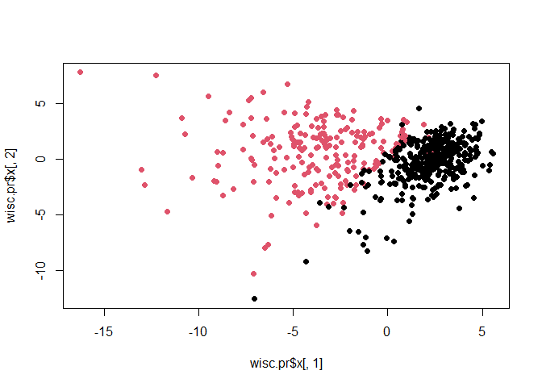
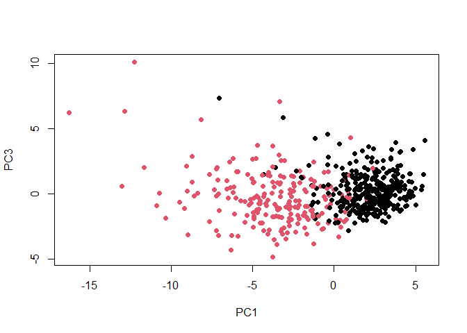
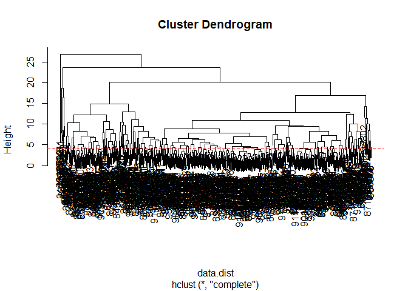
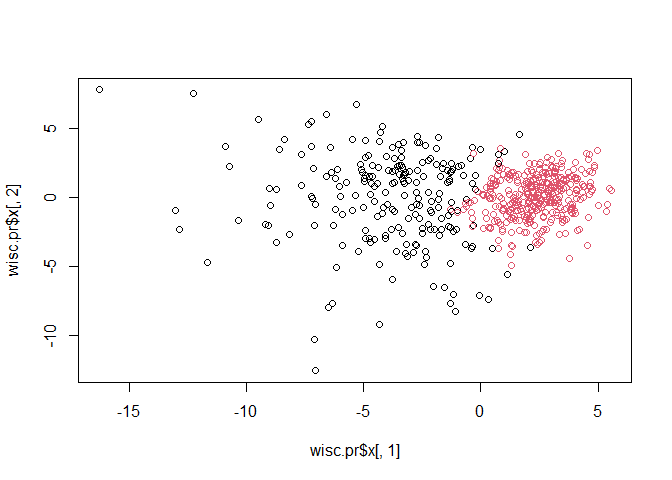

# BIMM143class08

\##Outline Today we will apply the machine learning methods we
introduced in the last class on breast cancer biopsy data from the fine
needle aspiration (FNA)

\##Data input The data is supplied on CSV format:

``` r
# Save your input data file into your Project directory
fna.data <- "WisconsinCancer.csv"

# input the data and store as wisc.df
wisc.df <- read.csv(fna.data, row.names=1)
head(wisc.df)
```

             diagnosis radius_mean texture_mean perimeter_mean area_mean
    842302           M       17.99        10.38         122.80    1001.0
    842517           M       20.57        17.77         132.90    1326.0
    84300903         M       19.69        21.25         130.00    1203.0
    84348301         M       11.42        20.38          77.58     386.1
    84358402         M       20.29        14.34         135.10    1297.0
    843786           M       12.45        15.70          82.57     477.1
             smoothness_mean compactness_mean concavity_mean concave.points_mean
    842302           0.11840          0.27760         0.3001             0.14710
    842517           0.08474          0.07864         0.0869             0.07017
    84300903         0.10960          0.15990         0.1974             0.12790
    84348301         0.14250          0.28390         0.2414             0.10520
    84358402         0.10030          0.13280         0.1980             0.10430
    843786           0.12780          0.17000         0.1578             0.08089
             symmetry_mean fractal_dimension_mean radius_se texture_se perimeter_se
    842302          0.2419                0.07871    1.0950     0.9053        8.589
    842517          0.1812                0.05667    0.5435     0.7339        3.398
    84300903        0.2069                0.05999    0.7456     0.7869        4.585
    84348301        0.2597                0.09744    0.4956     1.1560        3.445
    84358402        0.1809                0.05883    0.7572     0.7813        5.438
    843786          0.2087                0.07613    0.3345     0.8902        2.217
             area_se smoothness_se compactness_se concavity_se concave.points_se
    842302    153.40      0.006399        0.04904      0.05373           0.01587
    842517     74.08      0.005225        0.01308      0.01860           0.01340
    84300903   94.03      0.006150        0.04006      0.03832           0.02058
    84348301   27.23      0.009110        0.07458      0.05661           0.01867
    84358402   94.44      0.011490        0.02461      0.05688           0.01885
    843786     27.19      0.007510        0.03345      0.03672           0.01137
             symmetry_se fractal_dimension_se radius_worst texture_worst
    842302       0.03003             0.006193        25.38         17.33
    842517       0.01389             0.003532        24.99         23.41
    84300903     0.02250             0.004571        23.57         25.53
    84348301     0.05963             0.009208        14.91         26.50
    84358402     0.01756             0.005115        22.54         16.67
    843786       0.02165             0.005082        15.47         23.75
             perimeter_worst area_worst smoothness_worst compactness_worst
    842302            184.60     2019.0           0.1622            0.6656
    842517            158.80     1956.0           0.1238            0.1866
    84300903          152.50     1709.0           0.1444            0.4245
    84348301           98.87      567.7           0.2098            0.8663
    84358402          152.20     1575.0           0.1374            0.2050
    843786            103.40      741.6           0.1791            0.5249
             concavity_worst concave.points_worst symmetry_worst
    842302            0.7119               0.2654         0.4601
    842517            0.2416               0.1860         0.2750
    84300903          0.4504               0.2430         0.3613
    84348301          0.6869               0.2575         0.6638
    84358402          0.4000               0.1625         0.2364
    843786            0.5355               0.1741         0.3985
             fractal_dimension_worst
    842302                   0.11890
    842517                   0.08902
    84300903                 0.08758
    84348301                 0.17300
    84358402                 0.07678
    843786                   0.12440

``` r
##Now I will store the diagnosis column for later 
##and exclude it from the data set I will actually 
##do things with that I will call `wisc.data()` 
##-1 to remove first column
wisc.data<-wisc.df[,-1]
diagnosis<-as.factor(wisc.df$diagnosis)
```

> Q1 How many people are in this data set?

``` r
nrow(wisc.df)
```

    [1] 569

> Q2. How many of the observations have a malignant diagnosis?

``` r
##use table to figure out which type the patients fall under benign B or malignant M
table(wisc.df$diagnosis)
```


      B   M 
    357 212 

``` r
##you can also do sum of the thing that equal to M 
##which is inside the parentheses. 
##Inside parentheses are true false. Remeber T=1, F=0
sum(wisc.df$diagnosis=="M")
```

    [1] 212

``` r
##So 212
```

> Q3. How many variables/features in the data are suffixed with \_mean?

``` r
##use grep function to find the column that 
##have character and then length to find the total

x<-colnames(wisc.data)
length(grep("_mean", x))
```

    [1] 10

``` r
##Principal Component Analysis

##We need to scale our input data before PCA 
##as some of the columns ar emeasured in terms of 
##very different units with different means and different variants. 
##THe upshot is we set `scale=TRUE` 

colMeans(wisc.data)
```

                radius_mean            texture_mean          perimeter_mean 
               1.412729e+01            1.928965e+01            9.196903e+01 
                  area_mean         smoothness_mean        compactness_mean 
               6.548891e+02            9.636028e-02            1.043410e-01 
             concavity_mean     concave.points_mean           symmetry_mean 
               8.879932e-02            4.891915e-02            1.811619e-01 
     fractal_dimension_mean               radius_se              texture_se 
               6.279761e-02            4.051721e-01            1.216853e+00 
               perimeter_se                 area_se           smoothness_se 
               2.866059e+00            4.033708e+01            7.040979e-03 
             compactness_se            concavity_se       concave.points_se 
               2.547814e-02            3.189372e-02            1.179614e-02 
                symmetry_se    fractal_dimension_se            radius_worst 
               2.054230e-02            3.794904e-03            1.626919e+01 
              texture_worst         perimeter_worst              area_worst 
               2.567722e+01            1.072612e+02            8.805831e+02 
           smoothness_worst       compactness_worst         concavity_worst 
               1.323686e-01            2.542650e-01            2.721885e-01 
       concave.points_worst          symmetry_worst fractal_dimension_worst 
               1.146062e-01            2.900756e-01            8.394582e-02 

``` r
apply(wisc.data,2,sd)
```

                radius_mean            texture_mean          perimeter_mean 
               3.524049e+00            4.301036e+00            2.429898e+01 
                  area_mean         smoothness_mean        compactness_mean 
               3.519141e+02            1.406413e-02            5.281276e-02 
             concavity_mean     concave.points_mean           symmetry_mean 
               7.971981e-02            3.880284e-02            2.741428e-02 
     fractal_dimension_mean               radius_se              texture_se 
               7.060363e-03            2.773127e-01            5.516484e-01 
               perimeter_se                 area_se           smoothness_se 
               2.021855e+00            4.549101e+01            3.002518e-03 
             compactness_se            concavity_se       concave.points_se 
               1.790818e-02            3.018606e-02            6.170285e-03 
                symmetry_se    fractal_dimension_se            radius_worst 
               8.266372e-03            2.646071e-03            4.833242e+00 
              texture_worst         perimeter_worst              area_worst 
               6.146258e+00            3.360254e+01            5.693570e+02 
           smoothness_worst       compactness_worst         concavity_worst 
               2.283243e-02            1.573365e-01            2.086243e-01 
       concave.points_worst          symmetry_worst fractal_dimension_worst 
               6.573234e-02            6.186747e-02            1.806127e-02 

``` r
wisc.pr <- prcomp( wisc.data, scale=TRUE )

##summary to get the percent variance and every important info we want

summary(wisc.pr)
```

    Importance of components:
                              PC1    PC2     PC3     PC4     PC5     PC6     PC7
    Standard deviation     3.6444 2.3857 1.67867 1.40735 1.28403 1.09880 0.82172
    Proportion of Variance 0.4427 0.1897 0.09393 0.06602 0.05496 0.04025 0.02251
    Cumulative Proportion  0.4427 0.6324 0.72636 0.79239 0.84734 0.88759 0.91010
                               PC8    PC9    PC10   PC11    PC12    PC13    PC14
    Standard deviation     0.69037 0.6457 0.59219 0.5421 0.51104 0.49128 0.39624
    Proportion of Variance 0.01589 0.0139 0.01169 0.0098 0.00871 0.00805 0.00523
    Cumulative Proportion  0.92598 0.9399 0.95157 0.9614 0.97007 0.97812 0.98335
                              PC15    PC16    PC17    PC18    PC19    PC20   PC21
    Standard deviation     0.30681 0.28260 0.24372 0.22939 0.22244 0.17652 0.1731
    Proportion of Variance 0.00314 0.00266 0.00198 0.00175 0.00165 0.00104 0.0010
    Cumulative Proportion  0.98649 0.98915 0.99113 0.99288 0.99453 0.99557 0.9966
                              PC22    PC23   PC24    PC25    PC26    PC27    PC28
    Standard deviation     0.16565 0.15602 0.1344 0.12442 0.09043 0.08307 0.03987
    Proportion of Variance 0.00091 0.00081 0.0006 0.00052 0.00027 0.00023 0.00005
    Cumulative Proportion  0.99749 0.99830 0.9989 0.99942 0.99969 0.99992 0.99997
                              PC29    PC30
    Standard deviation     0.02736 0.01153
    Proportion of Variance 0.00002 0.00000
    Cumulative Proportion  1.00000 1.00000

``` r
##
plot(wisc.pr$x[,1], wisc.pr$x[,2], col=diagnosis, pch=16)
```



> Q4. From your results, what proportion of the original variance is
> captured by the first principal components (PC1)?

around 44.27%

> Q5. How many principal components (PCs) are required to describe at
> least 70% of the original variance in the data?

Three

\##proportion of variance tells you how much each PC represents.
Cumulative proportion adds them all up

> Q6. How many principal components (PCs) are required to describe at
> least 90% of the original variance in the data?

Seven

``` r
biplot(wisc.pr)
```


> Q7 What stands out to you about this plot? Is it easy or difficult to
> understand? Why?

It is very dense and confusing. Cannot identify each and every element,
difficult to understand.

``` r
head(wisc.pr$x)
```

                   PC1        PC2        PC3       PC4        PC5         PC6
    842302   -9.184755  -1.946870 -1.1221788 3.6305364  1.1940595  1.41018364
    842517   -2.385703   3.764859 -0.5288274 1.1172808 -0.6212284  0.02863116
    84300903 -5.728855   1.074229 -0.5512625 0.9112808  0.1769302  0.54097615
    84348301 -7.116691 -10.266556 -3.2299475 0.1524129  2.9582754  3.05073750
    84358402 -3.931842   1.946359  1.3885450 2.9380542 -0.5462667 -1.22541641
    843786   -2.378155  -3.946456 -2.9322967 0.9402096  1.0551135 -0.45064213
                     PC7         PC8         PC9       PC10       PC11       PC12
    842302    2.15747152  0.39805698 -0.15698023 -0.8766305 -0.2627243 -0.8582593
    842517    0.01334635 -0.24077660 -0.71127897  1.1060218 -0.8124048  0.1577838
    84300903 -0.66757908 -0.09728813  0.02404449  0.4538760  0.6050715  0.1242777
    84348301  1.42865363 -1.05863376 -1.40420412 -1.1159933  1.1505012  1.0104267
    84358402 -0.93538950 -0.63581661 -0.26357355  0.3773724 -0.6507870 -0.1104183
    843786    0.49001396  0.16529843 -0.13335576 -0.5299649 -0.1096698  0.0813699
                    PC13         PC14         PC15        PC16        PC17
    842302    0.10329677 -0.690196797  0.601264078  0.74446075 -0.26523740
    842517   -0.94269981 -0.652900844 -0.008966977 -0.64823831 -0.01719707
    84300903 -0.41026561  0.016665095 -0.482994760  0.32482472  0.19075064
    84348301 -0.93245070 -0.486988399  0.168699395  0.05132509  0.48220960
    84358402  0.38760691 -0.538706543 -0.310046684 -0.15247165  0.13302526
    843786   -0.02625135  0.003133944 -0.178447576 -0.01270566  0.19671335
                    PC18       PC19        PC20         PC21        PC22
    842302   -0.54907956  0.1336499  0.34526111  0.096430045 -0.06878939
    842517    0.31801756 -0.2473470 -0.11403274 -0.077259494  0.09449530
    84300903 -0.08789759 -0.3922812 -0.20435242  0.310793246  0.06025601
    84348301 -0.03584323 -0.0267241 -0.46432511  0.433811661  0.20308706
    84358402 -0.01869779  0.4610302  0.06543782 -0.116442469  0.01763433
    843786   -0.29727706 -0.1297265 -0.07117453 -0.002400178  0.10108043
                    PC23         PC24         PC25         PC26        PC27
    842302    0.08444429  0.175102213  0.150887294 -0.201326305 -0.25236294
    842517   -0.21752666 -0.011280193  0.170360355 -0.041092627  0.18111081
    84300903 -0.07422581 -0.102671419 -0.171007656  0.004731249  0.04952586
    84348301 -0.12399554 -0.153294780 -0.077427574 -0.274982822  0.18330078
    84358402  0.13933105  0.005327110 -0.003059371  0.039219780  0.03213957
    843786    0.03344819 -0.002837749 -0.122282765 -0.030272333 -0.08438081
                      PC28         PC29          PC30
    842302   -0.0338846387  0.045607590  0.0471277407
    842517    0.0325955021 -0.005682424  0.0018662342
    84300903  0.0469844833  0.003143131 -0.0007498749
    84348301  0.0424469831 -0.069233868  0.0199198881
    84358402 -0.0347556386  0.005033481 -0.0211951203
    843786    0.0007296587 -0.019703996 -0.0034564331

``` r
### Scatter plot observations by PC 1 and 2 help us see better

##you can either do column 1, column two like 
##before or just set the column and then the 
##PC1 and PC2 becomes x and y lab respectively 
##so note it later if that makes sense. But as 
##can be seen later this only works for default PC1/PC2
plot(wisc.pr$x, col=diagnosis, xlab="PC1",ylab="PC2" )
```


``` r
##Q8. Generate a similar plot for 
##principal components 1 and 3. 
##What do you notice about these plots?

## Repeat for components 1 and 3
##you can do c(,) inside the square brackets 
##to choose two columns or two PCA that is not 
##the first two and is sequential 
##(so not 1,2 but things like 1,3, 2,3, 2,10 etc)
plot(wisc.pr$x[,c(1,3)], col = diagnosis, 
     xlab = "PC1", ylab = "PC3")
```


``` r
plot(wisc.pr$x[,1], wisc.pr$x[,3], xlab="PC1", ylab="PC3", col=diagnosis, pch=16)
```



``` r
##i guess you can either do 
##wisc.pr$x[,c(1,3)]
 ##wisc.pr$x[,1], wisc.pr$x[,3]
```

``` r
## Repeat for components 1 and 3
##plot(wisc.pr$x[,], col = diagnosis, 
##xlab = "PC1", ylab = "PC3")
##this is wrong. You need to tell it that it
##is column 1 or 3 otherwise they will default to column 1 and 2
##also the [] part does not seem to matter as much i guess

##Anyhow to answer question 8, it seems that compared to 
##PC1 vs PC2, the black concentration part location
##is now ##slighly lower compared to before?
##Also because PC2 contributed to more variance,
##the separation is more clear than when compared
##to PC3??
```

``` r
# Create a data.frame for ggplot because that is the input
df <- as.data.frame(wisc.pr$x)
df$diagnosis <- diagnosis

# Load the ggplot2 package
library(ggplot2)

# Make a scatter plot colored by diagnosis
ggplot(df) + 
  aes(PC1, PC2, col=diagnosis) + 
  geom_point()
```


``` r
##calculating variance

pr.var<-wisc.pr$sdev^2

head(pr.var)
```

    [1] 13.281608  5.691355  2.817949  1.980640  1.648731  1.207357

``` r
## Variance explained by each principal component: pve
pve<-pr.var/sum(pr.var)

##Plot variance explained for each principal component

plot(pve, xlab = "Principal Component", 
     ylab = "Proportion of Variance Explained", 
     ylim = c(0, 1), type = "o")
```


``` r
# Alternative scree plot of the same data, please take a look at the y-axis
barplot(pve, ylab = "Precent of Variance Explained",
     names.arg=paste0("PC",1:length(pve)), las=2, axes = FALSE)
axis(2, at=pve, labels=round(pve,2)*100 )
```


``` r
library(factoextra)
```

    Welcome! Want to learn more? See two factoextra-related books at https://goo.gl/ve3WBa

``` r
fviz_eig(wisc.pr, addlabels = TRUE)
```


> Q9. For the first principal component, what is the component of the
> loading vector (i.e. wisc.pr\$rotation\[,1\]) for the feature
> concave.points_mean?

-0.26085376

``` r
##it is one of the columns of wisc.df
wisc.pr$rotation[,1]
```

                radius_mean            texture_mean          perimeter_mean 
                -0.21890244             -0.10372458             -0.22753729 
                  area_mean         smoothness_mean        compactness_mean 
                -0.22099499             -0.14258969             -0.23928535 
             concavity_mean     concave.points_mean           symmetry_mean 
                -0.25840048             -0.26085376             -0.13816696 
     fractal_dimension_mean               radius_se              texture_se 
                -0.06436335             -0.20597878             -0.01742803 
               perimeter_se                 area_se           smoothness_se 
                -0.21132592             -0.20286964             -0.01453145 
             compactness_se            concavity_se       concave.points_se 
                -0.17039345             -0.15358979             -0.18341740 
                symmetry_se    fractal_dimension_se            radius_worst 
                -0.04249842             -0.10256832             -0.22799663 
              texture_worst         perimeter_worst              area_worst 
                -0.10446933             -0.23663968             -0.22487053 
           smoothness_worst       compactness_worst         concavity_worst 
                -0.12795256             -0.21009588             -0.22876753 
       concave.points_worst          symmetry_worst fractal_dimension_worst 
                -0.25088597             -0.12290456             -0.13178394 

> Q10. What is the minimum number of principal components required to
> explain 80% of the variance of the data?

5

At least to section \#5 question 15

``` r
data.scaled<-scale(wisc.data)
```

``` r
data.dist <- dist(data.scaled)
head(data.dist)
```

    [1] 10.309426  6.771675 10.463467  8.663413  8.402233  9.843286

``` r
wisc.hclust <- hclust(data.dist, method="complete")
wisc.hclust
```


    Call:
    hclust(d = data.dist, method = "complete")

    Cluster method   : complete 
    Distance         : euclidean 
    Number of objects: 569 

``` r
## Q.11 Using the plot() and abline() functions, 
##what is the height at which the clustering model 
##has 4 clusters?
plot(wisc.hclust)
abline(h=4, col="red", lty=2)
```



``` r
##Answer is around 20??
```

``` r
##here it also shows that you can choose two columns 
##with [1:3]

wisc.hclust.clusters <- cutree(wisc.hclust, k=4)
##to compare just (,)
table(wisc.hclust.clusters, diagnosis)
```

                        diagnosis
    wisc.hclust.clusters   B   M
                       1  12 165
                       2   2   5
                       3 343  40
                       4   0   2

``` r
wisc.hclust.clusters2 <- cutree(wisc.hclust, k=2)
table(wisc.hclust.clusters2, diagnosis)
```

                         diagnosis
    wisc.hclust.clusters2   B   M
                        1 357 210
                        2   0   2

``` r
wisc.hclust.clusters3 <- cutree(wisc.hclust, k=10)
table(wisc.hclust.clusters3, diagnosis)
```

                         diagnosis
    wisc.hclust.clusters3   B   M
                       1   12  86
                       2    0  59
                       3    0   3
                       4  331  39
                       5    0  20
                       6    2   0
                       7   12   0
                       8    0   2
                       9    0   2
                       10   0   1

``` r
##Q12. Can you find a better cluster vs diagnoses 
##match by cutting into a different number of clusters between 2 and 10?
##Yes it seems the k value increases the more certain 
##the difference or gap in value between the two BM i
##ncreases


plot(wisc.hclust)
abline(h = 4, col = "red", lty = 2, method = "ward.D2")
```

    Warning in int_abline(a = a, b = b, h = h, v = v, untf = untf, ...): "method"
    is not a graphical parameter


``` r
plot(wisc.hclust)
abline(h = 4, col = "red", lty = 2, method = "single")
```

    Warning in int_abline(a = a, b = b, h = h, v = v, untf = untf, ...): "method"
    is not a graphical parameter


``` r
plot(wisc.hclust)
abline(h = 4, col = "red", lty = 2, method = "complete")
```

    Warning in int_abline(a = a, b = b, h = h, v = v, untf = untf, ...): "method"
    is not a graphical parameter


``` r
plot(wisc.hclust)
abline(h = 4, col = "red", lty = 2, method = "average")
```

    Warning in int_abline(a = a, b = b, h = h, v = v, untf = untf, ...): "method"
    is not a graphical parameter


``` r
##they all look the same to me
```

``` r
x<-scale(wisc.data)
wisc.km<-kmeans(x,centers=2,nstart=20)

table(wisc.km$cluster, diagnosis)
```

       diagnosis
          B   M
      1 343  37
      2  14 175

``` r
##Q14. How well does k-means separate the two diagnoses? 
##How does it compare to your hclust results?

table(wisc.km$cluster, wisc.hclust.clusters)
```

       wisc.hclust.clusters
          1   2   3   4
      1  17   0 363   0
      2 160   7  20   2

``` r
##well it seems both get the job done well
##at least in this case not a whole difference
```

``` r
d<-dist(wisc.pr$x[,1:7])
wisc.pr.hclust<-hclust(d, method="ward.D2")
plot(wisc.pr.hclust)
```


``` r
##wisc.hclust.clusters <- c
```

Generate 2 cluster groups from this hclust object

``` r
grps<-cutree(wisc.pr.hclust, k=2)
table(grps)
```

    grps
      1   2 
    216 353 

``` r
table(grps, diagnosis)
```

        diagnosis
    grps   B   M
       1  28 188
       2 329  24

``` r
##these two gets you the same graph
plot(wisc.pr$x[,1], wisc.pr$x[,2], col=grps)
```



``` r
plot(wisc.pr$x[,1:2], col=grps)
```


``` r
plot(wisc.pr$x[,1:2], col=diagnosis)
```


``` r
##swap colors by making it as factor
g <- as.factor(grps)
levels(g)
```

    [1] "1" "2"

``` r
g <- relevel(g,2)
levels(g)
```

    [1] "2" "1"

``` r
##Plot using our re-ordered factor 
plot(wisc.pr$x[,1:2], col=g)
```


``` r
##Q.15
wisc.pr.hclust.clusters <- cutree(wisc.pr.hclust, k=2)

table(wisc.pr.hclust.clusters, diagnosis)
```

                           diagnosis
    wisc.pr.hclust.clusters   B   M
                          1  28 188
                          2 329  24
